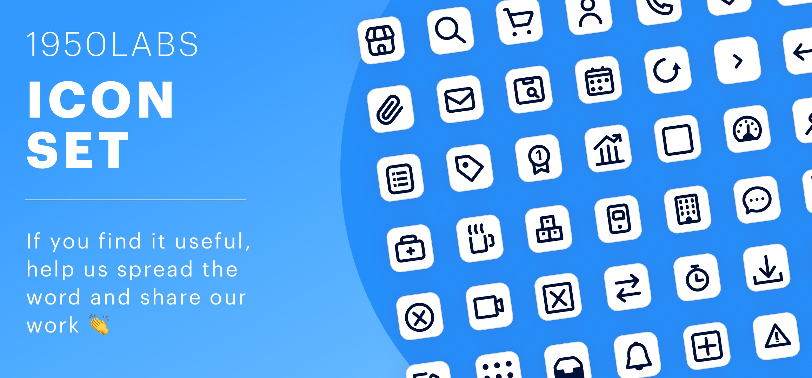

# 1950Labs-icon-set
## About the 1950Labs Icon Set:
In 1950Labs we started some time ago to create and collect different icons that we believe are necessary in the software we develop, that's how we created the 1950Labs icon set. In this free downloadable icon set we can find in SVG and PNG icons that are necessary in any software. 

-	If you find it useful, help us spread the word and share our work 🤘
-	If you want to contribute or be aware --> contact us at uiux@1950labs.com 🙌
-	If you need this icons in another format: let's collaborate! 🤜 🤛

## About 1950Labs:
1950Labs is a boutique software development shop specialized in remote staffing. Our main strength is with Fintech, Automotive industries and UX/UI Design, using Microsoft technologies and modern front end frameworks like AngularJS, Angular2, ReactJS and Bootstrap and design tools like Sketch and InVision.

We manage the biggest community of developers, designers and testers ( UruguayIT.com ). Due to that, if we don’t have available the talent you need, we can find it faster than any other company in LATAM.

You can check our work on [Dribbble](https://dribbble.com/1950labs) and follow us to find about our new posts and projects!

Please route all business inquiries to hello@1950labs.com.

For any design inquiry please contact us at uiux@1950labs.com
